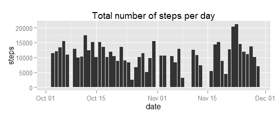
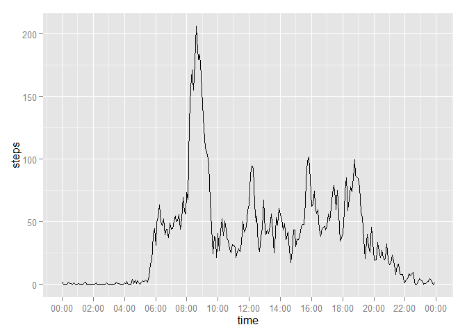
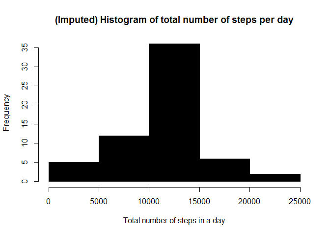
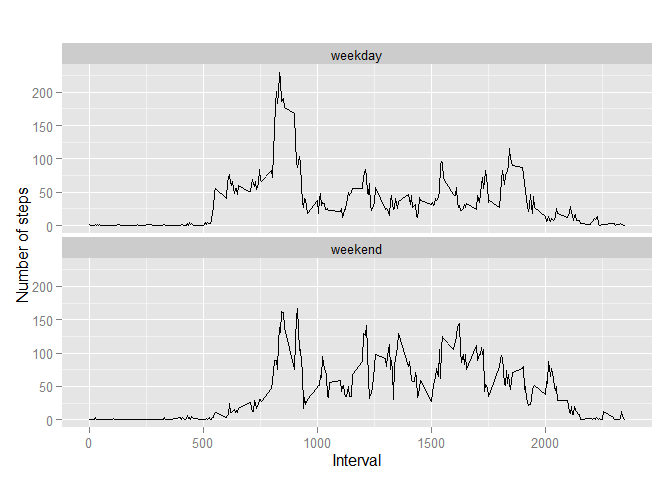

# Reproducible Research: Peer Assessment 1


```r
## Loading and preprocessing the data


##Code for Reading the Dataset
connection <- unz("./repdata-data-activity.zip",filename = "activity.csv")
activity <- read.csv(file = connection,header = T)

summary(activity)
```

```
##      steps                date          interval     
##  Min.   :  0.00   2012-10-01:  288   Min.   :   0.0  
##  1st Qu.:  0.00   2012-10-02:  288   1st Qu.: 588.8  
##  Median :  0.00   2012-10-03:  288   Median :1177.5  
##  Mean   : 37.38   2012-10-04:  288   Mean   :1177.5  
##  3rd Qu.: 12.00   2012-10-05:  288   3rd Qu.:1766.2  
##  Max.   :806.00   2012-10-06:  288   Max.   :2355.0  
##  NA's   :2304     (Other)   :15840
```

```r
##Formating the Data and adding new Column
activity$dt <- as.POSIXct(with(activity,paste(date,paste(interval %/% 100, interval %% 100, sep=":"))),format="%Y-%m-%d %H:%M",tz="")

##Necessary Libraries for plot
library(knitr)
```

```
## Warning: package 'knitr' was built under R version 3.1.3
```

```r
library(dplyr)
```

```
## Warning: package 'dplyr' was built under R version 3.1.3
```

```
## 
## Attaching package: 'dplyr'
## 
## The following object is masked from 'package:stats':
## 
##     filter
## 
## The following objects are masked from 'package:base':
## 
##     intersect, setdiff, setequal, union
```

```r
library(ggplot2)
```

```
## Warning: package 'ggplot2' was built under R version 3.1.3
```

```r
library(scales)
library(grid)
library(gridExtra)
```

```
## Warning: package 'gridExtra' was built under R version 3.1.3
```


## What is mean total number of steps taken per day?


```r
##Question 1-  Calculate the total number of steps taken per day

stepsPerDay <- setNames(
    aggregate(
        steps~as.Date(date),
        activity,
        sum,
        na.rm = TRUE),
    c("date","steps")
)
```


```r
library(ggplot2)

##Question 2- Make a histogram of the total number of steps taken each day

ggplot(stepsPerDay,aes(x=date,y=steps)) + 
    geom_bar(stat="identity") + 
    ggtitle("Total number of steps per day")
```

 


```r
##Question 3- Calculate and report the mean and median of the total number of steps taken per day


meanN <- c(mean = mean(stepsPerDay$steps),median = median(stepsPerDay$steps))

meanN
```

```
##     mean   median 
## 10766.19 10765.00
```


## What is the average daily activity pattern?


```r
##Question 1- Make a time series plot (i.e. type = "l") of the 5-minute interval (x-axis) and the average number of steps taken, averaged across all days (y-axis)


avgPattern <- aggregate(steps~interval,activity,mean,na.rm = TRUE)

avgPattern$time <- as.POSIXct(with(avgPattern,paste(interval %/% 100, interval %% 100, sep=":")),format="%H:%M")

#Plotting 
ggplot(avgPattern,aes(x=time,y=steps)) + 
    geom_line() + 
    scale_x_datetime(breaks = date_breaks("2 hour"),labels = date_format("%H:%M"))
```

 

```r
## Question 2- Which 5-minute interval, on average across all the days in the dataset, contains the maximum number of steps?

with(avgPattern,avgPattern[steps == max(steps),])
```

```
##     interval    steps                time
## 104      835 206.1698 2015-06-14 08:35:00
```

## Imputing missing values


```r
## Question 1- Calculate and report the total number of missing values in the dataset (i.e. the total number of rows with NAs)


sum(is.na(activity))
```

```
## [1] 2304
```


```r
## Question 2- Devise a strategy for filling in all of the missing values in the dataset. The strategy does not need to be sophisticated. For example, you could use the mean/median for that day, or the mean for that 5-minute interval, etc.

data_imputed <- activity
for (i in 1:nrow(data_imputed)) {
    if (is.na(data_imputed$steps[i])) {
        interval_value <- data_imputed$interval[i]
        steps_value <- avgPattern[
            avgPattern$interval == interval_value,]
        data_imputed$steps[i] <- steps_value$steps
    }
}
##View(activity)
##View(data_imputed)
```


```r
##Question 3- Create a new dataset that is equal to the original dataset but with the missing data filled in.

table_date_steps_by_day <- aggregate(steps ~ date, data_imputed, sum)
head(table_date_steps_by_day)
```

```
##         date    steps
## 1 2012-10-01 10766.19
## 2 2012-10-02   126.00
## 3 2012-10-03 11352.00
## 4 2012-10-04 12116.00
## 5 2012-10-05 13294.00
## 6 2012-10-06 15420.00
```


```r
## Question 4- Make a histogram of the total number of steps taken each day and Calculate and report the mean and median total number of steps taken per day. Do these values differ from the estimates from the first part of the assignment? What is the impact of imputing missing data on the estimates of the total daily number of steps?

hist(table_date_steps_by_day$steps, col=1, main="(Imputed) Histogram of total number of steps per day", xlab="Total number of steps in a day")
```

 

```r
# get mean and median of total number of steps per day

meanN2 <- c(mean = mean(table_date_steps_by_day$steps),median = median(table_date_steps_by_day$steps))

comparison <- rbind(source = meanN, fixed = meanN2, delta = meanN2-meanN)
comparison
```

```
##            mean       median
## source 10766.19 10765.000000
## fixed  10766.19 10766.188679
## delta      0.00     1.188679
```

## Are there differences in activity patterns between weekdays and weekends?


```r
##Question 1- Create a new factor variable in the dataset with two levels – “weekday” and “weekend” indicating whether a given date is a weekday or weekend day

data_imputed['type_of_day'] <- weekdays(as.Date(data_imputed$date))
data_imputed$type_of_day[data_imputed$type_of_day  %in% c('Saturday','Sunday') ] <- "weekend"
data_imputed$type_of_day[data_imputed$type_of_day != "weekend"] <- "weekday"


# convert type_of_day from character to factor
data_imputed$type_of_day <- as.factor(data_imputed$type_of_day)

# calculate average steps by interval across all days
data_imputed_steps_by_interval <- aggregate(steps ~ interval + type_of_day, data_imputed, mean)
```


```r
##Question 2- Make a panel plot containing a time series plot (i.e. type = "l") of the 5-minute interval (x-axis) and the average number of steps taken, averaged across all weekday days or weekend days (y-axis). See the README file in the GitHub repository to see an example of what this plot should look like using simulated data
# creat a plot
qplot(interval, 
      steps, 
      data = data_imputed_steps_by_interval, 
      type = 'l', 
      geom=c("line"),
      xlab = "Interval", 
      ylab = "Number of steps", 
      main = "") +
    facet_wrap(~ type_of_day, ncol = 1)
```

 
